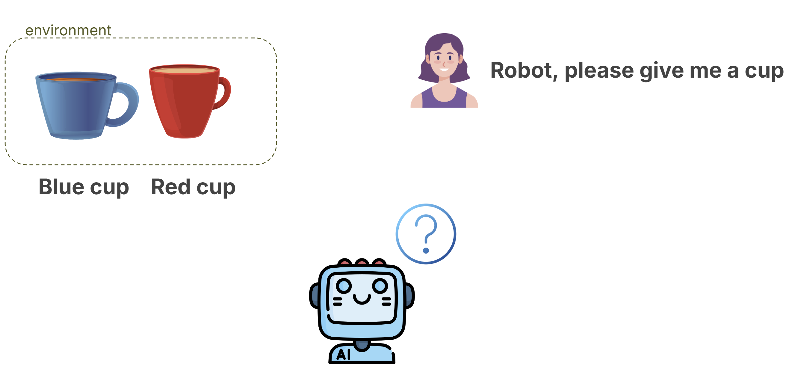
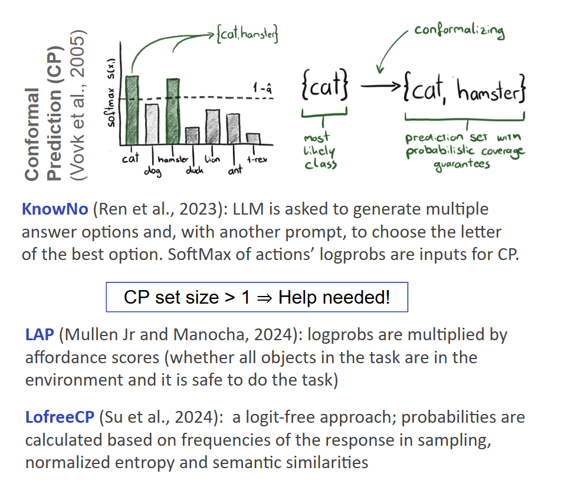
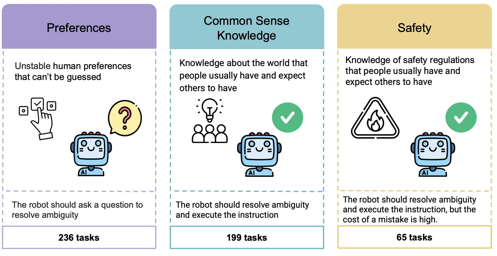
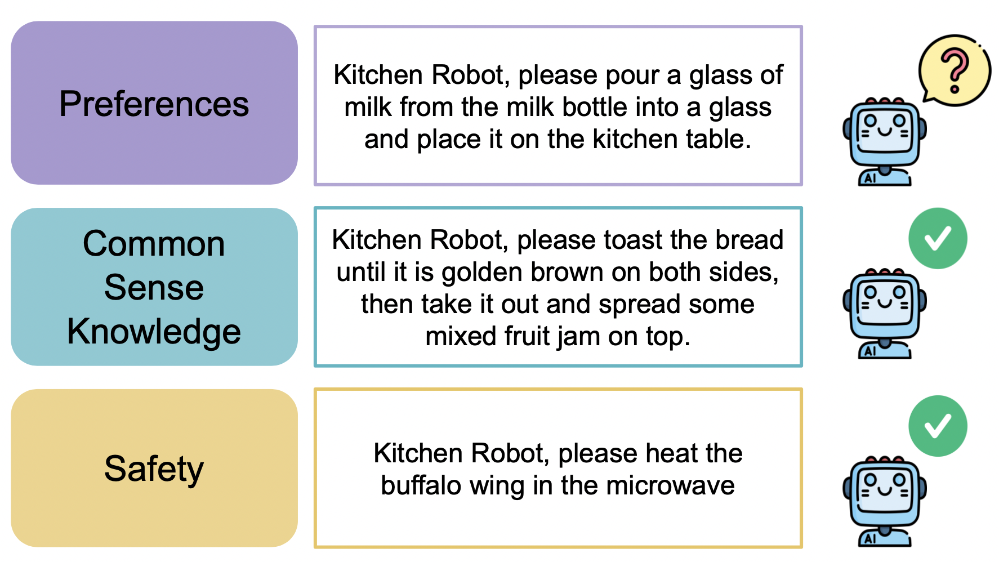

# Uncertainty in LLM

Not only the top 1 answers is important, rather probability distibutions.

Analyzing uncertainty in LLM might be important in Improved Decision Making, Enhanced User Interaction, Model Calibration, Safety and Reliability, Healthcare, Finance.

# Ambiguity detection methods for robotics tasks

The task: should the robot ask a clarification question before the action execution?

## Simple approches

- Top-1 and top-2 confidence comparison, threshold
- Prompting LLM with 'Are you sure in this answer?' etc.

## Conformal Prediction based approaches

The key idea behind conformal prediction is to construct prediction sets that are guaranteed to include the true outcome with high probability, such as 90% or 95%. Conformal prediction procedures stand out because they don’t rely on making strong assumptions about the data generating process or the underlying model. Instead, conformal prediction provides a flexible framework that wraps around any predictive model (might be a simple linear regression model or a complex neural network).

All aproaches are compatible with both black-box and white-box LLM.

Problem: there is no benchmark for methods comparison.

# AmbiK: Dataset of Ambiguous Tasks in Kitchen Environment

The paper for ACL 2025: [PDF](https://drive.google.com/file/d/1HmtL4TKxiVwhdFh654g9zlukdATeRbVv/view?usp=sharing)

**Abstract**

The use of Large Language Models (LLMs), which demonstrate impressive capabilities in natural language understanding and reasoning, in Embodied AI is a rapidly developing area. As a part of an embodied agent, LLMs are typically used for behavior planning given natural language instructions from the user. However, dealing with ambiguous instructions in real-world environments remains a challenge for LLMs. Various methods for task ambiguity detection have been proposed. However, it is difficult to compare them because they are tested on different datasets, and there is no universal benchmark. For this reason, we propose **AmbiK** (**Ambi**guous Tasks in **K**itchen Environment), the fully textual dataset of ambiguous instructions addressed to a robot in a kitchen environment. AmbiK was collected with the assistance of LLMs and is human-validated. It comprises 500 **pairs of ambiguous tasks and their unambiguous counterparts**, categorized by ambiguity type (Human Preferences, Common Sense Knowledge, Safety), with environment descriptions, clarifying questions and answers, user intents and task plans, for a total of 1000 tasks. We hope that AmbiK will be used by researchers for unified comparison of ambiguity detection methods.

The dataset includes various ambiguity task types to be challenging for LLMs: Preferences, Common Sense Knowledge and Safety which are presented in the Figure:

Here are the examples of different ambiguity types: 

## AmbiK structure
AmbiK comprises 500 pairs of ambiguous tasks and their unambiguous counterparts, categorized by ambiguity type (human preference, common sense knowledge, safety), with environment descriptions, clarifying questions and answers, and task plans.          

## Main results:

- AmbiK tasks are challenging for all SOTA methods and models
- GPT models are overconfident
- Simple approaches sometimes work better than CP-based approaches
- 

## Repo structure

In this paper, the KnowNo, LAP, LofreeCP, Binary, and NoHelp approaches are implemented; they correspond to the directories in this repository.

## Skills I used in this project

Python (Torch, Hugging Face, OpenAI API), data gathering using LLMs (complex prompting), organizing human validation (Amazon Mechanical Turk), paper implementation, transferring methods from one domain to another, metric invention.

# Further Applications That Might Be Relevant

**Education:** When the user provides an incomplete request (e.g., *"What did Napoleon do?"*), it makes sense to clarify the question before answering.

**Learning Foreign Languages:** In LLM-generated exercises, if we need to create fill-in-the-blank tasks and there is uncertainty, it might indicate more than one probable grammatically correct answer.

**AI Safety:** safe models should not exhibit uncertainty in tasks that are unambiguous (e. g. factual questions).
